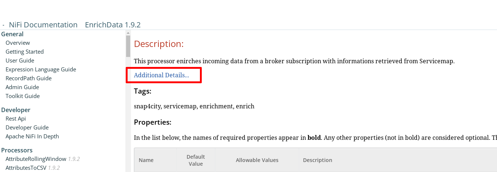
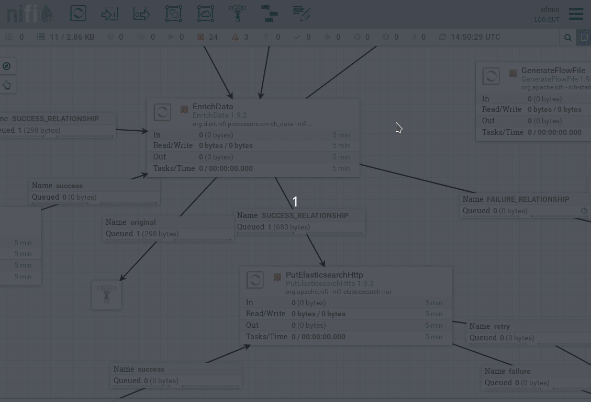
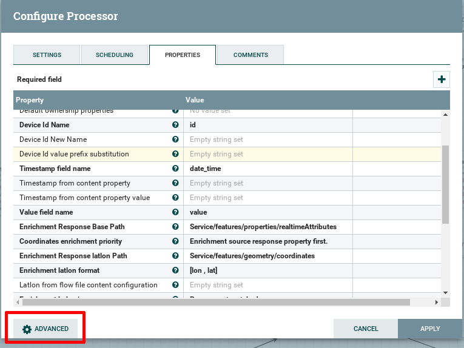
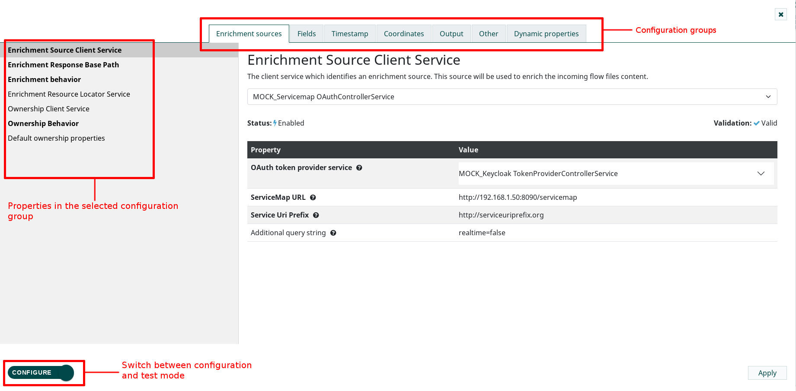
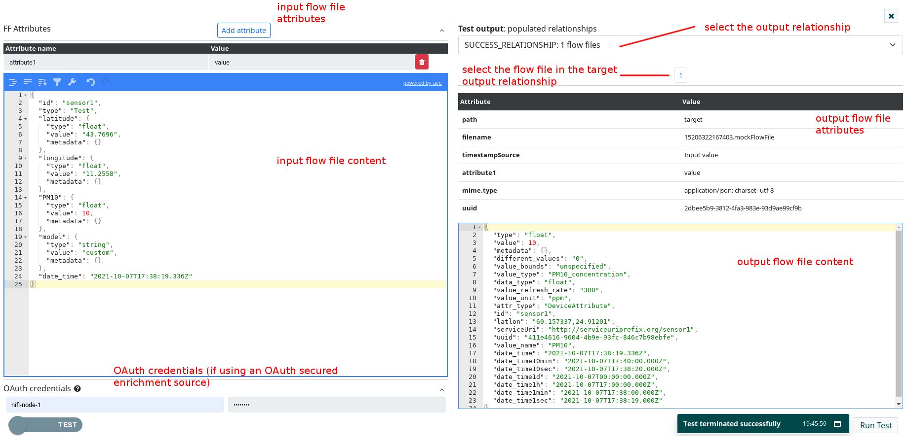
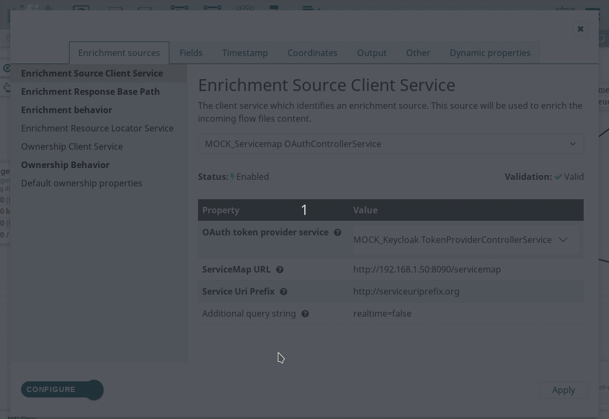

# NIFI-processors / enrich-data

Apache NiFi target version: `1.9.2`.  
(The components provided by this bundle may not work on other Apache NiFi versions or the installation procedures described in this documentation may not be valid.)

## Index
* [Build](#build)   
* [Installation](#installation)  
	* [Fresh installation](#fresh-installation)
		* [The node configuration file](#the-node-configuration-file)  
	* [Upgrade from a previous bundle version](#upgrade-from-a-previous-bundle-version)  
* [Additional documentation](#additional-documentation)
* [Dataflow configuration](#dataflow-configuration)
* [Enrichment Source Client Service configuration](#enrichment-source-client-service-configuration)
* [Output](#output)
* [Custom EnrichData UI](#custom-enrich-data-ui)

This bundle includes the following Apache NiFi components:  

**Processors**:
* EnrichData
* UpdateEnrichmentSource
* OwnershipEnrichData

**ControllerServices**:
* Servicemap:
	* ServicemapControllerService
	* ServicemapOAuthControllerService
* Ownership:
	* OwnershipControllerService
	* OwnershipOAuthControllerService
* Keyclaok/OAuth:
	* KeycloakTokenProviderControllerService
* IOTDirectory:
	* IOTDirectoryLocatorControllerService
	* IOTDirectoryOAuthLocatorControllerService


## Build:

The bundle must be built using [Apache Maven](https://maven.apache.org/).

To build the bundle:
1. `cd` into the bundle top level folder `/enrich-data` ).

2. Then `mvn clean package` to start the build.  
  **Note**: If you wish to skip the unit tests execution during the build process use:

	```
	mvn clean package -DskipTests
	```

If the build succeeds, a `.tar` archive containing the bundle is produced in:

```
distribution/target/nifi-enrich-data-bundle-1.9.2.tar
```

The content of the archive will be:

```
nifi-enrich-data-bundle-1.9.2
├── nifi
│   ├── conf
│   │   └── enrich-data.conf
│   └── extensions
│       ├── nifi-enrich-data-nar-1.9.2.nar
│       ├── nifi-enrichment-source-client-service-api-nar-1.9.2.nar
│       ├── nifi-oauth-token-provider-service-nar-1.9.2.nar
│       ├── nifi-ownership-client-service-nar-1.9.2.nar
│       ├── nifi-resource-locator-services-nar-1.9.2.nar
│       └── nifi-servicemap-client-services-nar-1.9.2.nar
└── test-tools
	└── test-server
			├── bin
			│   └── test_server.sh
			├── conf
			│   ├── conf.yml
			│   ├── iotdirectory
			│   │   └── subid_1.json
			│   ├── ownership
			│   │   └── sensor1_ownership.json
			│   └── servicemap
			│       └── sensor1.json
			└── lib
					└── test-tools.jar
```

* The `nifi` folder contains the files to be copied in NiFi to install the bundle (`.nar` archives and configuration files).  
* The `test-tools` folder contains utilities to perform tests, for example mocking the services external to NiFi on which the EnrichData processor relies (Servicemap, Ownership, IOTDirectory).

## Installation:

### Fresh Installation

To install the bundle for the **first time** on a NiFi instance copy all the `.nar` archives from `nifi-enrich-data-bundle-1.9.2/nifi/extensions` to the folder configured as:
```
nifi.nar.library.autoload.directory
```
in the `nifi.properties` file of the target instance.  
By default `<NiFi Home>/extensions`.

Such directory is scanned by NiFi every 30s for new .nars which will be unpacked and loaded.  
This applies only to new libraries, **already loaded libraries will not be reloaded**.

To see the bundle processors and controller services listed a **refresh of the browser window** may be required.

#### The node configuration file
Due to the fact that the processor's configurations are cluster-wide, to add different configurations for every single node a file has been predisposed.  
The path of such file can be configured in the `EnrichData` processor in the `Node config file path` property, and it must be accessible by the NiFi instances.  
A template for the configuration file can be found in:

```
nifi-enrich-data-bundle-1.9.2/nifi/conf/enrich-data.conf
```
You can copy this file in a location accessible to NiFi ( Eg: `<NiFi Home>/conf` ) and point to that file in the processor configurations.

### Upgrade from a previous bundle version

If the `.nar` archives of the `enrich-data-bundle` are already present in the NiFi autoload directory (`<NiFi Home>/extensions` by default) you need to replace the old .nars with the new ones as described in the Fresh Installation steps, but **a NiFi restart is required**.

**NOTE**: if the target NiFi is clustered make sure to update the bundle on every node and restart every node.

## Additional documentation
Additional documentation on the processors is provided by the built-in NiFi documentation accessible through `Right click on processor` -> `View usage`.  
For the `EnrichData` processor some properties e explained in details in the page displayed by the `Additional details ...` link in the usage documentation.



## Dataflow configuration:

The `EnrichData` processor is designed to operate on the output flow files from the `IngestData` processor, but it can basically operate on any flow file with a valid JSON object in its content.  
An example of standard ingestion flow using such processors:  


The behavior of the `EnrichData` processor can be described as following:
1. Parse the incoming flow files content as JSON.
2. Determine the location of the target resource and retrieve the enrichment data using the configure `Enrichment Source Client Service`.
4. Enrich the flow file content with the retrieved enrichment data.
5. Produce the output flow file(s) according to the configured output format.

For example, if the incoming flow file content is:
```
{
  "id":"abcde0123" ,
  "type":"aType" ,
  "measure1":{
    "value":10
  } ,
  "measure2":{
    "value":11.2
  } ,
  "date_time":"2020-01-01T12:00:00.000Z"
}
```

and the enrichment data retrieved is:

```
{
  "measure1":{
    "type":"int"
  },
  "measure2":{
    "type":"float"
  }
}
```

the content of the output flow file will be similar to:
```
{
  "id":"abcde0123" ,
  "type":"aType" ,
  "measure1":{
    "type":"int" ,
    "value":10 ,
    "date_time":"2020-01-01T12:00:00.000Z"
  } ,
  "measure2":{
    "type":"float" ,
    "value":11.2 ,
    "date_time":"2020-01-01T12:00:00.000Z"
  }
}
```

Note that the timestamp contained in the "date_time" attribute is added to every measure in the resulting flow file content (or to every flow file in case of "Split Json Object" output mode). The name of the timestamp attribute is configurable.

### Enrichment Source Client Service configuration
We refer to the service which provides the enrichment data as the **enrichment source**.  
Currently the only enrichment source supported is ServiceMap (eventually with JWT authentication using Keycloak).

To configure the enrichment source for the EnrichData processor you need to create a controller service of type `ServicemapControllerService` or `ServicempaOAuthControllerService`.  
These controller services provide a confiugured HTTP client to the processor, and the processor uses such client to retrieve the enrichment data from the enrichment source.

The configurations common to both controller service types are:
* **Servicemap URL**: the url for the servicemap requests
* **Service Uri Prefix**: the prefix for the `serviceUri` parameter of the get request. This prefix will be concatenated to the content of the field specified by `Device Id Name` in the enrich data processor to build the full request url.
* **Additional query string**: additional query string to add after the `serviceUri` parameter.

The produced url has the following format:
```
<Servicemap Url>?serviceUri=<Service Uri prefix>/<DEVICE ID>&<Additional query string>
```

The **ServicemapOAuthControllerService** needs **KeycloakControllerService** in order to retrieve the access token to pass to servicemap.
The KeycloakTokenProviderService can be configured as 'OAuth token provider service' in the ServicempaOAuthControllerService.

In order to configure the **KeycloakTokenProviderService** you need to specify:  
* **Keycloak URL**: the base url of the Keycloak instance.
* **Client ID**: the client id.
* **Client Secret**: the client secret.
* **Realm**: the realm name.
* **Username**: the username.
* **Password**: the password.

The client will retrieve the JWT from the Keycloak instance using the provided credentials and the EnrichData processor will perform the GET requests to the Servicemap with the header:
```
Authorization: Bearer <JWT_BASE64_CONTENT>
```

## Output
The output mode is configurable by the property **"Output flow file content format"**, there are 3 available modes:
* **JSON** : for each incoming flow file produces an output flow file containing the enriched object (with all measures) in it's content.

* **Split Json** : for each incoming flow files produces an output flow file for each measure, containing the enriched measure and the fields external to the measure ( id, date_time, type ... )

* **Elasticsearch bulk indexing compliant"** : for each incoming flow file produces an output flow file with the content ready to be passed to an Elasticsearch Bulk indexing operation.  If using this output mode, you need to configure the properties **"ES index"** and **"ES type"**.

## Custom EnrichData UI



The `EnrichData` processor provides a custom GUI to configure the processor and perform enrichment tests without directly running the processor.
The custom GUI is accessible through `Right click on processor` -> `Configure` -> `Properties tab` -> `Advanced` (button at the bottom left corner):



The custom user interface has a `Configuration mode` which allows to configure the processor properties (like the standard Properties tab), but it groups related properties under different tabs and provides an enhanced JSON editor for the JSON properties.

The other mode is the `Test mode` which allows to run enrichment tests with the current processor configurations.

To switch between `Configuration` and `Test` mode use the toggle button in the bottom-left corner of the custom user interface.

#### Configuration UI

#### Testing UI:



The left part of the testing ui allows to set the input for the test, while the right part shows the test outputs.



## References
The processor's configurations properties are all fully explained in the embedded NiFi processor's usage documentation accessible through the `View usage` option by right clicking on the processor in the Nifi web UI.
