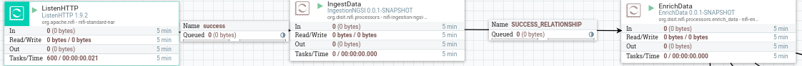

# NIFI-processors / enrich-data

This bundle includes the following Apache NiFi components:  

Processors:
* EnrichData
* UpdateEnrichmentSource
* OwnershipEnrichData

ControllerServices:
* ServicemapControllerService
* ServicemapOAuthControllerService
* OwnershipControllerService
* OwnershipOAuthControllerService
* KeycloakTokenProviderControllerService


## Build:

The bundle must be built using maven.

To build the bundle:
* `cd` into the bundle top level folder `/enrich-data` ).

* Then `mvn clean package -DskipTests`  
  **Note**: `-DskipTests` skip the unit tests execution

If the build succeed, a `.tar` archive is produced in the folder:

```
distribution/target/nifi-enrich-data-bundle-1.9.2.tar
```

The archive contains the following directory structure:

```
  dist
    |-- extensions
    |-- conf
```

The `extensions` folder contains the nar archives.  
The `conf` folder contains configuration files.

## Installation:

To install the bundle copy all the nar archives contained in `dist/extensions` to the
`lib` subfolder of your NiFi installation root (Eg: `/srv/nifi/lib` ), then restart the NiFi instance with:

```
/srv/nifi/nifi.sh restart
```

**Note**: for the `EnrichData` processor to work, actually, a node configuration file must exists and it's path must be configured in the processor's configuration. A template of such configuration file can be found in:

```
dist/conf/enrich-data.conf
```
You can copy this file in a location accessible to NiFi ( Eg: `/srv/nifi/conf` ) and point to that file in the processor configurations.


**Note**: alternatively, from `Nifi-1.9` a bundle can be installed by copying the nar archive in the `extension` subfolder of the Nifi installation root ( Eg: `/srv/nifi/extensions` ), **WITHOUT RESTARTING THE NIFI INSTANCE**.  
If you are updating the bundle from a previous version **you still need to restart** the nifi instance(s) to reload the nar archives (NiFi cannot detect changes in the nar archives at runtime).

## Additional documentation
Additional documentation on the processors is provided by the built-in NiFi documentation accessible through `Right click on processor` -> `View usage`.  
For some processors the properties configurations are explained in details in the page displayed by the `Additional details ...` link in the usage documentation.

## Dataflow configuration:

The `EnrichData` processor is designed to operate on the output flow files from the `IngestData` processor, but it can basically operate on any flow file with a valid JSON object in its content.  
An example of standard ingestion flow using such processors:  


The behavior of the `EnrichData` processor can be described as following:
1. Parse the incoming flow files content as JSON.
2. Determine the location of the target resource and retrieve the enrichment data using the configure `Enrichment Source Client Service`.
4. Enrich the flow file content with the retrieved enrichment data.
5. Produce the output flow file(s) according to the configured output format.

For example, if the incoming flow file content is:
```
{
  "id":"abcde0123" ,
  "type":"aType" ,
  "measure1":{
    "value":10
  } ,
  "measure2":{
    "value":11.2
  } ,
  "date_time":"2020-01-01T12:00:00.000Z"
}
```

and the enrichment data retrieved is:

```
{
  "measure1":{
    "type":"int"
  },
  "measure2":{
    "type":"float"
  }
}
```

the content of the output flow file will be similar to:
```
{
  "id":"abcde0123" ,
  "type":"aType" ,
  "measure1":{
    "type":"int" ,
    "value":10 ,
    "date_time":"2020-01-01T12:00:00.000Z"
  } ,
  "measure2":{
    "type":"float" ,
    "value":11.2 ,
    "date_time":"2020-01-01T12:00:00.000Z"
  }
}
```

Note that the timestamp contained in the "date_time" attribute is added to every measure in the resulting flow file content (or to every flow file in case of "Split Json Object" output mode). The name of the timestamp attribute is configurable.

### Enrichment Source Client Service configuration
We refer to the service which provides the enrichment data as the **enrichment source**.  
Currently the only enrichment source supported is ServiceMap (eventually with JWT authentication using Keycloak).

To configure the enrichment source for the EnrichData processor you need to create a controller service of type `ServicemapControllerService` or `ServicempaOAuthControllerService`.  
These controller services provide a confiugured HTTP client to the processor, and the processor uses such client to retrieve the enrichment data from the enrichment source.

The configurations common to both controller service types are:
* **Servicemap URL**: the url for the servicemap requests
* **Service Uri Prefix**: the prefix for the `serviceUri` parameter of the get request. This prefix will be concatenated to the content of the field specified by `Device Id Name` in the enrich data processor to build the full request url.
* **Additional query string**: additional query string to add after the `serviceUri` parameter.

The produced url has the following format:
```
<Servicemap Url>?serviceUri=<Service Uri prefix>/<DEVICE ID>&<Additional query string>
```

The **ServicemapOAuthControllerService** needs **KeycloakControllerService** in order to retrieve the access token to pass to servicemap.
The KeycloakTokenProviderService can be configured as 'OAuth token provider service' in the ServicempaOAuthControllerService.

In order to configure the **KeycloakTokenProviderService** you need to specify:  
* **Keycloak URL**: the base url of the Keycloak instance.
* **Client ID**: the client id.
* **Client Secret**: the client secret.
* **Realm**: the realm name.
* **Username**: the username.
* **Password**: the password.

The client will retrieve the JWT from the Keycloak instance using the provided credentials and the EnrichData processor will perform the GET requests to the Servicemap with the header:
```
Authorization: Bearer <JWT_BASE64_CONTENT>
```

### Output
The output mode is configurable by the property **"Output flow file content format"**, there are 3 available modes:
* **JSON** : for each incoming flow file produces an output flow file containing the enriched object (with all measures) in it's content.

* **Split Json** : for each incoming flow files produces an output flow file for each measure, containing the enriched measure and the fields external to the measure ( id, date_time, type ... )

* **Elasticsearch bulk indexing compliant"** : for each incoming flow file produces an output flow file with the content ready to be passed to an Elasticsearch Bulk indexing operation.  If using this output mode, you need to configure the properties **"ES index"** and **"ES type"**.

### Individual node config

Due to the fact that the processor's configurations are cluster-wide, to add different configurations for every single node a file has been predisposed.  
**This file must exists and be accessible to the Nifi instance on every cluster's node.**  
The file path must be specified in the **"Node config file path"** property.

Current supported options:
* **timestampFromContent.useFallback**

Example:
```
# In case of timestamp picked from the flow file content after the enrichment
# this property tells to the processor if the fallback must be used or not, in case
# there's no valid field in the flow file from which to pick the timestamp.
# The fallback consists in using the value of the timestamp field (before the enrichment step)
# specified by 'Timestamp field name' in the processor configurations.
#
# default value: true
timestampFromContent.useFallback = true
```

### References
The processor's configurations properties are all fully explained in the embedded NiFi processor's usage documentation accessible through the `View usage` option by right clicking on the processor in the Nifi web UI.
